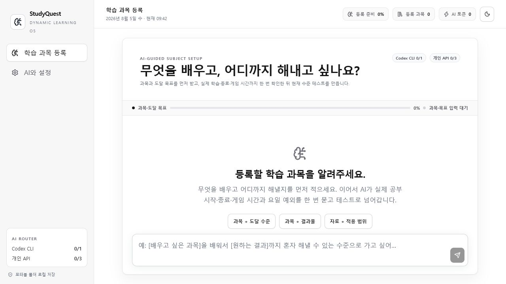
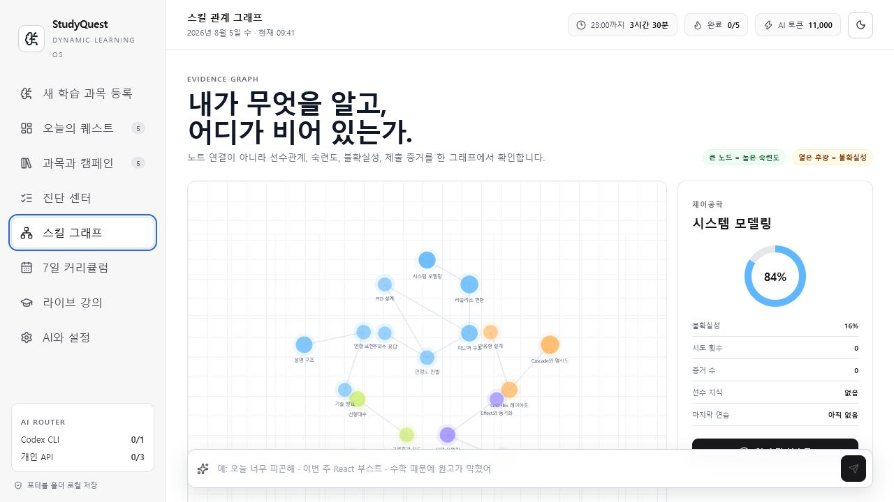
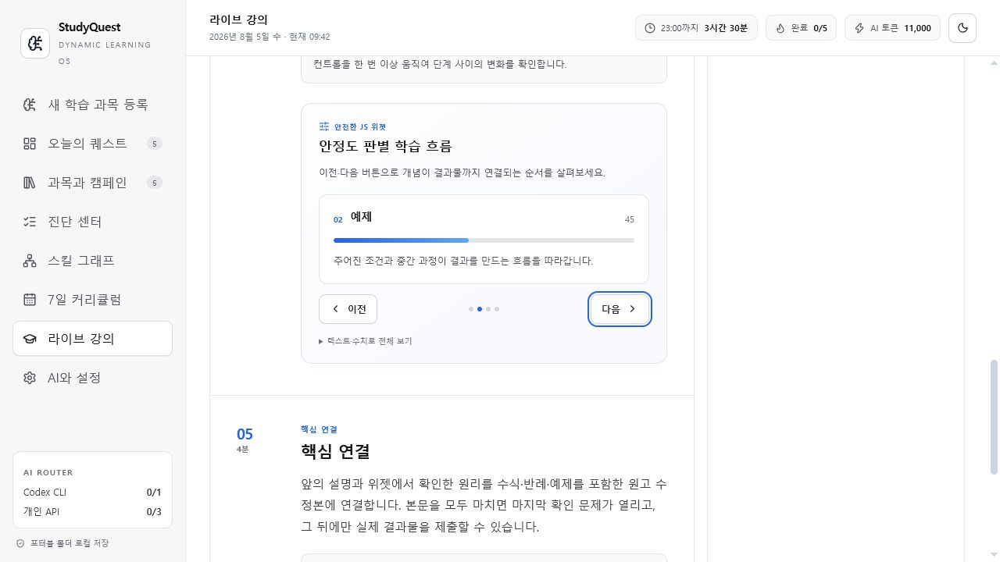
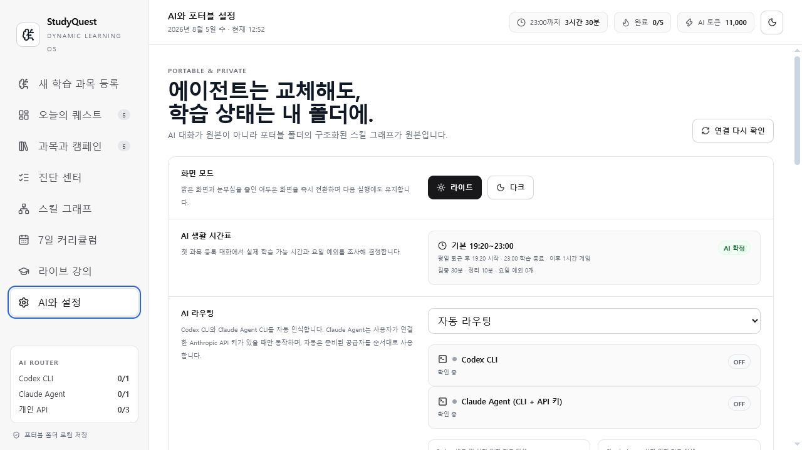

# StudyQuest

여러 과목을 하나의 퀘스트 시스템으로 관리하는 Windows용 AI 학습 데스크톱 앱입니다.

배우고 싶은 과목과 목표를 대화로 설명하면 StudyQuest가 수행형 진단을 만들고, 답안을 바탕으로 스킬 관계 그래프와 7일 커리큘럼을 구성합니다. 각 퀘스트는 읽기 강의, 대화형 실험실, 마지막 확인 문제로 이어집니다.

> 현재 버전은 초기 개발 단계의 `0.1.1`이며 Windows x64와 한국어 중심 UI를 대상으로 합니다.

## 화면과 학습 흐름

### 1. 과목과 생활 시간을 인터뷰합니다

첫 실행에는 미리 등록된 과목이 없습니다. 대화창에 무엇을 배우고 싶은지, 어디까지 도달하고 싶은지 적습니다. 최초 인터뷰에서는 실제 학습 시작·종료 시각, 게임 시간, 요일별 예외도 함께 조사합니다.



### 2. 수행형 테스트로 시작점을 찾습니다

자기평가 슬라이더 대신 AI가 만든 질문에 직접 답합니다. AI는 설명, 적용, 새로운 상황으로의 전이 증거를 평가하고, 인터뷰와 진단이 끝난 뒤에만 과목을 등록합니다.

### 3. 여러 과목을 스킬 그래프로 관리합니다

숙련도, 불확실성, 선수 관계를 그래프로 표시합니다. 자연어로 특정 과목을 부스트하면 우선순위와 일일 분량을 다시 계산합니다.



### 4. 퇴근 후 시간을 퀘스트로 배분합니다

학습 종료 시각부터 역산해 여러 과목의 퀘스트를 배치하고, 인터뷰에서 정한 게임 시간을 보호합니다. 남은 시간 안에 끝낼 수 없는 라이브 강의는 시작을 막습니다.

게임 시간 보호는 계획과 타이머를 조정하는 기능입니다. 게임이나 다른 프로그램을 실행하거나 강제로 종료하지는 않습니다.

### 5. 읽고, 실험하고, 마지막에 확인합니다

각 퀘스트에는 약 30분 분량의 읽기 중심 강의가 생성됩니다. 과목에 따라 단계 비교, 매개변수 변화, 또는 AI가 만든 HTML/CSS/JavaScript 실험실이 포함될 수 있습니다. 실험실은 초기화할 수 있고 생성된 코드도 확인할 수 있습니다. 질문은 강의 중간에 반복하지 않고 마지막 확인 단계에 모읍니다.



## 주요 기능

- 빈 상태에서 시작하는 대화형 과목 등록
- 생활 시간표와 목표를 반영한 수행형 진단
- 숙련도·불확실성·선수 관계 스킬 그래프
- 여러 과목의 7일 커리큘럼과 동적 부스팅
- 읽기 강의, 선언형 위젯, AI 생성 iframe 실험실
- 마지막 이해도 확인과 퀘스트 결과 평가
- PDF·DOCX·RTF·EPUB·텍스트 계열 학습 자료의 로컬 본문 추출
- 영어 등 음성 답변의 녹음·재생과 선택적 OpenAI 전사
- 라이트·다크 모드
- 호출별 공급자, 토큰, 비용 사용 이력
- Codex, Claude Agent 및 BYOK API 공급자와 CLI 실행 경로, 데이터 저장 위치 설정

## 설치

### 릴리스 ZIP으로 실행

1. [Releases](https://github.com/gongdolle/Studyquest/releases)에서 Windows x64 ZIP을 내려받습니다.
2. ZIP을 쓰기 가능한 별도 폴더에 압축 해제합니다.
3. 압축을 푼 폴더의 `StudyQuest.cmd`를 실행합니다.
4. `AI와 설정` 화면에서 사용할 공급자가 인식되는지 확인합니다.

Claude Agent는 선택 기능입니다. 사용하려면 Anthropic이 배포하는 Claude CLI를 사용자가
별도로 설치하고, StudyQuest 설정에서 감지된 실행 파일 또는 직접 찾은 실행 파일의 정확한
경로를 승인해야 합니다. 자동 감지만으로는 실행하거나 API 키를 전달하지 않습니다.
StudyQuest는 Claude CLI를 번들하거나 자동 설치하지 않습니다. CLI 경로를 승인하고
사용자의 Anthropic API 키를 저장한 뒤 AI 라우팅에서 Claude Agent를 직접 선택해야 합니다.

현재 빌드는 설치 프로그램이나 자동 업데이트를 사용하지 않는 포터블 앱입니다. `Program Files` 같은 시스템 폴더보다 사용자 문서 또는 별도 앱 폴더에 압축을 푸는 것을 권장합니다.

> 현재 개발 빌드는 코드 서명이 없습니다. Windows SmartScreen 경고가 표시될 수 있으므로 반드시 이 저장소의 Release에서 받은 파일인지 확인한 뒤 실행하세요.

앱을 제거하려면 StudyQuest를 종료한 뒤 압축을 푼 폴더를 삭제합니다. 설정에서 데이터 위치를 다른 폴더로 바꿨다면 그 폴더는 별도로 확인해야 합니다.

### 소스에서 실행

권장 환경은 Windows 10/11 x64, Node.js 24, npm입니다.

```powershell
git clone https://github.com/gongdolle/Studyquest.git
cd Studyquest
npm ci
npm.cmd test
npm.cmd run desktop
```

포터블 패키지를 만들려면 다음을 실행합니다.

```powershell
npm.cmd run package:portable
```

패키지는 `portable/StudyQuest-win32-x64/`에 생성되며, 저장소 루트의 `StudyQuest.cmd`가 해당 실행 파일을 엽니다.

`npm run dev`는 Vite 렌더러만 실행합니다. Electron 저장소, CLI 호출, 문서 선택 등 데스크톱 기능까지 시험하려면 `npm run desktop`을 사용하세요.

## AI 공급자 연결



`AI와 설정`에서 자동 라우팅 또는 특정 공급자를 선택합니다.

| 공급자 | 연결 방식 | 필요한 준비 |
| --- | --- | --- |
| 자동 라우팅 | 사용 가능한 공급자를 순서대로 시도 | Codex·OpenAI·Claude API·DeepSeek 중 하나 이상 |
| Codex CLI | `@openai/codex-sdk` 앱 통합과 Codex 실행 경로 | 사용자가 별도로 완료한 Codex 인증 |
| Claude Agent | 사용자가 설치한 로컬 Claude CLI | Claude CLI 실행 경로와 사용자의 Anthropic API 키 |
| OpenAI API | HTTPS API | 사용자의 OpenAI API 키 |
| Claude API | Anthropic BYOK HTTPS API | 사용자의 Anthropic API 키 |
| DeepSeek API | HTTPS API | 사용자의 DeepSeek API 키 |

자동 라우팅은 현재 사용 가능한 공급자 중 Codex CLI, OpenAI API, Claude API, DeepSeek API 순으로 시도합니다. 앞 공급자가 인증·요율 제한·일시 장애 등으로 실패하면 지원되는 오류에 한해 다음 공급자로 넘어갑니다. 로컬 실행 파일에 키가 예기치 않게 전달되지 않도록 Claude Agent는 자동 라우팅에 포함하지 않으며, 사용자가 설정에서 Claude Agent를 직접 선택한 경우에만 호출합니다.

### Codex CLI

- `@openai/codex-sdk`는 Codex를 StudyQuest에 연결하기 위한 앱 통합 계층입니다.
- 사용자는 Codex의 공식 인증 흐름으로 별도 인증해야 합니다.
- StudyQuest는 Codex 로그인 정보, 세션 토큰 또는 인증 파일을 복사하거나 저장하지 않습니다.
- Codex 인증 정보는 Codex가 관리하며 StudyQuest의 포터블 데이터와 분리됩니다. StudyQuest 폴더를 삭제해도 Codex 인증 정보는 함께 삭제되지 않습니다.
- StudyQuest는 Codex 실행 구성을 자동 확인하며, 필요한 경우 설정에서 실행 파일을 직접 지정한 뒤 자동 탐색으로 되돌릴 수 있습니다.
- 실행 구성 탐지는 인증 성공까지 보장하지 않습니다. 인증 문제는 첫 모델 호출에서 확인될 수 있습니다.

StudyQuest는 Codex를 전역 설치하거나 사용자의 인증 파일을 수정하지 않습니다. 배포 구성에 Codex 실행 구성요소가 포함된 경우에도 모델 사용에는 사용자가 별도로 완료한 Codex 인증이 필요합니다.

Codex는 임시 세션, 읽기 전용 샌드박스, 웹 검색 비활성화 상태로 호출합니다.

### Claude Agent

- Claude Agent는 사용자가 별도로 설치한 로컬 Claude CLI를 StudyQuest의 비대화형 AI 백엔드로 호출하는 선택 기능입니다.
- 설정은 Claude CLI 설치 위치를 감지해 보여줄 수 있지만, 사용자가 정확한 실행 파일 경로를 승인하기 전에는 실행하지 않습니다. 승인 화면에는 키가 전달될 실제 경로가 표시됩니다.
- 사용자가 StudyQuest에 저장한 개인 Anthropic API 키가 반드시 필요합니다. CLI 설치 또는 기존 로그인만으로는 활성화되지 않습니다.
- AI 라우팅에서 Claude Agent를 직접 선택해야 하며, 기본 자동 라우팅은 Claude Agent를 호출하지 않습니다.
- StudyQuest는 호출할 때 해당 키를 자식 프로세스의 `ANTHROPIC_API_KEY` 환경 변수로만 전달하며, 명령줄 인수에는 넣지 않습니다.
- Claude CLI는 현재 데이터 루트 아래의 격리된 전용 설정 디렉터리와 `--bare` 모드로 실행됩니다. Claude 구독 OAuth, 기존 Claude 로그인, hooks, plugins, MCP, `CLAUDE.md` 또는 세션 토큰을 읽거나 대신 사용하지 않으며, API 키가 없으면 호출을 차단합니다.
- 안전한 `--bare` 모드가 있는 Claude CLI `2.1.81` 이상이 필요합니다. StudyQuest는 실행 전 기능 지원 여부를 다시 검사하고, 구버전이면 업데이트 안내와 함께 닫힌 상태로 실패합니다. 자세한 동작은 Anthropic의 [Headless mode 안내](https://code.claude.com/docs/en/headless)를 참고하세요.
- 승인된 경로를 해제하면 Claude Agent는 즉시 비활성화되며, 다시 승인하기 전까지 자동 감지된 CLI에 키를 전달하지 않습니다.
- StudyQuest는 Claude CLI를 설치·업데이트·제거하거나 CLI의 인증 파일을 수정하지 않습니다. CLI 자체의 설치와 라이선스는 사용자가 Anthropic의 공식 안내에 따라 별도로 관리합니다.

이 연결 경계는 제3자 제품에서 Free·Pro·Max 구독 자격을 중계하지 말고 API 키 인증을 사용하도록 안내하는 Anthropic의 [Legal and compliance 안내](https://code.claude.com/docs/en/legal-and-compliance)에 맞춘 것입니다.

### Claude API

Claude API는 로컬 CLI를 거치지 않고 Anthropic HTTPS API에 직접 연결합니다. 이 방식도 사용자가 직접 입력한 개인 Anthropic API 키를 사용하는 BYOK 연결이며, Claude 구독의 OAuth 자격을 대신 사용하거나 다른 사용자에게 중계하지 않습니다.

Claude Agent와 Claude API는 설정에 저장된 동일한 Anthropic API 키와 모델을 공유합니다. 연결 방식을 바꿀 때 키를 중복 저장할 필요는 없으며, 두 방식의 호출 비용은 모두 해당 Anthropic API 계정에 적용됩니다.

### 직접 API 연결

OpenAI, Anthropic, DeepSeek는 사용자가 API 키와 모델 이름을 직접 입력합니다.

- API 키는 일반 학습 상태와 분리합니다.
- Electron `safeStorage`로 현재 Windows 사용자에게 묶인 암호문을 저장합니다.
- Anthropic API 키는 사용자가 실행 파일 경로를 승인하고 AI 라우팅에서 Claude Agent를 직접 선택한 경우에만 해당 Claude CLI 자식 프로세스에 전달합니다. Codex CLI나 다른 외부 프로그램에는 전달하지 않습니다.
- 다른 PC나 다른 Windows 사용자에게 데이터 폴더를 옮기면 API 키를 다시 입력해야 합니다.
- 저장, 연결 확인, 연결 삭제를 설정 화면에서 수행할 수 있습니다.

Codex 사용 한도와 OpenAI·Anthropic·DeepSeek API 호출 비용은 각 사용자 계정에 적용됩니다. Claude Agent도 사용자가 제공한 Anthropic API 키로 호출되므로 해당 API 계정에 비용이 청구됩니다. StudyQuest의 월간 토큰 예산은 화면 표시용 기준이며 공급자 계정의 실제 한도를 제한하지 않습니다. 정확한 사용량과 청구액은 각 공급자의 관리 화면에서 확인하세요.

## 학습 자료와 음성의 전송 범위

### 문서

다음 형식의 본문을 로컬에서 추출합니다.

- PDF, DOCX, RTF, EPUB
- TXT, Markdown, CSV, JSON 등 텍스트 계열

원본 파일 자체를 자동 업로드하지는 않습니다. 다만 추출한 본문 미리보기, 사용자가 편집한 현재 학습 구간, 파일 이름과 관련 학습 문맥은 강의·진단·커리큘럼·평가를 만들 때 선택한 AI 공급자에게 프롬프트로 전송될 수 있습니다. 민감한 문서는 등록하지 마세요.

현재 `.doc`, `.hwp`, `.hwpx`와 이미지 OCR은 지원하지 않습니다. 안전한 추출 한도와 형식 검증을 넘은 문서는 거부될 수 있습니다.

### 음성

마이크 녹음과 재생은 로컬에서 동작합니다. 원음은 자동 저장하지 않습니다. 사용자가 전사 버튼을 누른 경우에만 해당 녹음을 OpenAI 전사 API로 보내며, 자동 전사에는 사용자의 OpenAI API 연결이 필요합니다. 이후 선택한 AI 평가는 원음이 아니라 전사문을 사용합니다.

## 데이터 위치와 삭제

기본 데이터 위치는 압축을 푼 포터블 루트 아래의 `data/`입니다.

```text
StudyQuest/
├─ StudyQuest.cmd
├─ portable/
└─ data/
   ├─ state/
   ├─ credentials/
   ├─ providers/
   ├─ userData/
   ├─ sessionData/
   ├─ cache/
   ├─ logs/
   ├─ temp/
   └─ crashDumps/
```

설정에서 데이터 루트를 다른 폴더로 바꿀 수 있습니다.

- 변경은 앱 재시작 후 적용됩니다.
- 기존 데이터는 자동으로 이동하거나 삭제하지 않습니다.
- 드라이브 루트와 Windows 시스템 디렉터리는 데이터 위치로 선택할 수 없습니다.
- `providers/`에는 Claude Agent 같은 외부 실행기의 격리된 앱 전용 설정이 저장되며, API 키는 `credentials/`의 Windows 사용자 전용 암호문과 분리됩니다.
- 사용자가 지정한 Codex·Claude CLI 실행 경로와 데이터 위치는 포터블 설정 파일에 저장하지만, 이 파일에는 비밀 값을 넣을 수 없도록 검증합니다.
- 학습 상태 초기화는 과목·진단·커리큘럼을 비우며 Codex 인증은 건드리지 않습니다.

StudyQuest는 레지스트리, 시작 프로그램, Windows 서비스 또는 `Program Files` 설치 항목을 만들지 않습니다. 다만 Windows는 Prefetch, Defender, 이벤트 기록 같은 운영체제 차원의 흔적을 자체적으로 만들 수 있습니다.

## 보안 경계

현재 구현에는 다음 방어가 적용되어 있습니다.

- Electron context isolation과 renderer sandbox 활성화
- renderer와 하위 frame의 Node.js 통합 및 `webview` 비활성화
- 제한된 preload IPC만 노출
- 팝업, 임의 탐색, 외부 frame 요청 차단
- 메인 화면과 위젯 호스트의 Content Security Policy
- API 키와 일반 학습 상태의 분리 및 상태 파일 내 credential 필드 차단
- AI 결과의 작업별 JSON Schema 검증
- 프롬프트·출력 크기, 동시 요청 수, 실행 시간 제한
- 생성 위젯의 보수적인 HTML/CSS/JavaScript 검증
- 전용 프로토콜의 `sandbox="allow-scripts"` iframe에서 생성 위젯 실행
- 생성 위젯의 네트워크, 팝업, 부모 앱, Node.js, 파일, 저장소 접근 차단

이 구조는 위험을 줄이는 다층 방어이며 범용적인 불신 코드 실행 환경을 제공한다는 뜻은 아닙니다. 생성 JavaScript가 같은 renderer의 CPU를 과도하게 점유하는 상황까지 완전히 격리하지는 못합니다. StudyQuest는 반복문·타이머 등 위험 패턴을 보수적으로 거부하지만, 출처를 알 수 없는 임의 코드를 실행하는 용도로 사용하면 안 됩니다.

보안 문제는 공개 이슈 대신 [보안 정책](SECURITY.md)에 따라 비공개로 알려주세요.

## 개발과 테스트

기술 구성:

- Electron, React, TypeScript, Vite
- Vitest
- AJV JSON Schema validation
- `@openai/codex-sdk`
- `officeparser`

주요 명령:

```powershell
npm.cmd test
npm.cmd run build
npm.cmd run desktop
npm.cmd run package:portable
```

테스트는 학습 엔진, 프롬프트와 스키마, 로컬 상태 저장, 포터블 설정, API 키 저장, 문서 추출, 미디어 권한, AI 공급자 처리, iframe 보안 회귀 항목을 포함합니다.

## 현재 한계

- Windows x64만 패키징합니다.
- 설치 프로그램, 자동 업데이트, 코드 서명이 없습니다.
- 한국어 중심 UI입니다.
- AI 기능에는 인터넷 연결과 공급자 인증이 필요합니다.
- 생성된 설명, 수식, 코드, 채점은 틀릴 수 있으며 전문 서적·연구·시험·업무에 사용하기 전에 검증해야 합니다.
- 공급자의 모델, API 또는 CLI 출력 형식 변경으로 호환성 문제가 생길 수 있습니다.
- Codex·Claude CLI 실행 구성 탐지만으로 인증 상태를 완전히 사전 검증하지 못합니다.
- 음성 자동 전사는 OpenAI API 연결이 필요합니다.
- `.doc`, `.hwp`, `.hwpx`, 이미지 OCR은 지원하지 않습니다.
- 데이터 위치 변경 시 기존 데이터를 자동 마이그레이션하지 않습니다.
- 클라우드 동기화, 사용자 계정, 여러 기기 동기화, 협업 기능이 없습니다.
- 보수적인 코드 검증 때문에 복잡한 AI 실험실이 기본 위젯으로 대체될 수 있습니다.
- 앱의 사용량 화면은 공급자의 공식 청구 내역을 대신하지 않습니다.

## 개인정보와 비용 요약

단순 화면 탐색과 로컬 상태 저장은 모델 토큰을 사용하지 않습니다. 다음 작업을 실행할 때 선택한 공급자로 학습 문맥이 전송되고 토큰 또는 API 비용이 발생할 수 있습니다.

- 과목 등록 인터뷰
- 진단 생성과 답안 평가
- 7일 커리큘럼 생성
- 라이브 강의와 실험실 생성
- 퀘스트 결과 평가
- 음성 전사
- 사용자가 누른 API 연결 확인

전송 내용에는 인터뷰 기록, 답안, 일정 조건, 과목 상태, 등록 문서의 추출 본문이 포함될 수 있습니다. 사용 전 선택한 AI 공급자의 이용 약관과 개인정보 처리방침을 확인하세요.

## 기여와 라이선스

기여 방법은 [CONTRIBUTING.md](CONTRIBUTING.md)를 참고하세요.

StudyQuest는 [Beerware License, Revision 42](LICENSE)로 배포됩니다. 이 프로젝트가 마음에 들고 언젠가 저자 `gongdolle`을 만나게 된다면 맥주 한 잔을 사도 좋습니다.

Electron, Chromium, Codex SDK·CLI와 npm production 의존성은 각각의 라이선스를 따릅니다. 정확한 버전과 포터블 배포에 포함된 라이선스 원문 위치는 [제3자 라이선스 고지](THIRD-PARTY-NOTICES.md)를 확인하세요.

## 주의

StudyQuest는 학습 계획과 자기주도 학습을 돕는 실험적 도구입니다. 생성된 결과를 고위험 의사결정이나 검증되지 않은 전문 지식의 근거로 사용하지 마세요.
